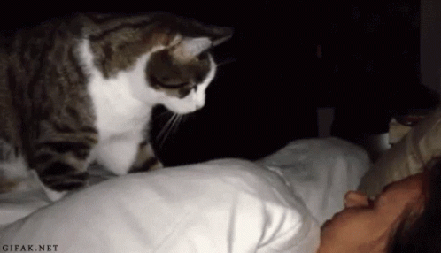

# No More Sleep! - Hook to bypass misused Sleep() function

Today it is a marginal problem, thanks to high-level languages ​​like C#. But there are still libraries that use delay functions.\
Everything is fine as long as your program is quite simple, but things get complicated when you write a 3D game or even create a simple GUI...\
\
NMS is designed to minimize this problem for existing applications, often closed source.\
It will not fix many other bugs, but it will speed up the execution of code that uses unnecessary delays, often with high values ​​(even 100ms for a GUI is too high!).

## Wrapper
The main library KRNL32.DLL is a Kernel32.dll wrapper that overrides the Sleep() function, forcing the time parameter to 0.\
The Sleep(0) call is necessary because some threads use Sleep() (with absurd values) to wait for I/O.

## Patcher
The included Autopatcher allows to redirect the imported library, by changing the file name in the Import headers.\
You can also do this manually by editing the files in hex editors or [CFF Explorer](https://ntcore.com/explorer-suite/).
